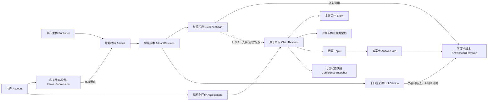
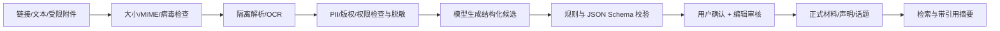
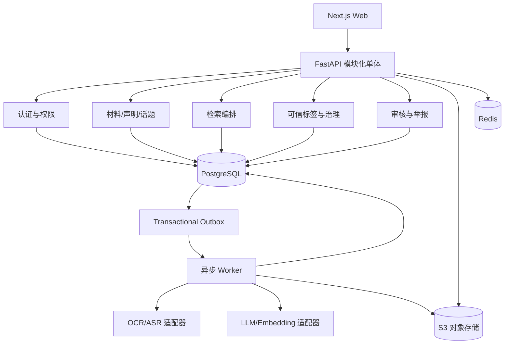

# 可信校园信息平台（西浦场景）：产品与技术详细设计

- 状态：Draft v0.2（交叉复核后）
- 日期：2026-08-29
- 上游想法：[intention.md](./intention.md)
- 适用阶段：需求验证、MVP 与首轮校园试点

## 1. 结论

### 1.1 合理性判断

这个产品方向**有条件合理，值得验证**。用户问题是真实的：信息分散、适用范围不清、时效难判断、官方规则与实际经验混在一起。但原始设想不能直接作为一期范围，因为它同时包含了信息聚合、知识图谱、社区、实名体系、信用评分和多媒体处理，工程与治理成本都过高。

建议把产品从“用知识图谱和大模型实现的校内知乎”收敛为：

> 面向西浦学生的、以来源与有效期为核心的校园信息检索和协作校验平台。

一句用户承诺是：

> 每个答案都说明从哪里来、适用于谁、截至何时，以及目前有哪些争议。

产品真正的差异化不是“有一个图谱”或“能 AI 问答”，而是把**原始材料、可核验声明、证据片段、适用范围和有效时间**连起来。知识图谱只是这套证据数据的查询投影，大模型只是整理助手，都不是事实裁判。

### 1.2 成立条件

只有同时满足以下条件，才建议继续扩大投入：

1. 首期只验证一个清晰人群与场景，例如“单一校区、单一入学届的新生到校与账号/办事”，其中再覆盖 2–3 个任务簇。
2. 每条正式答案都能回到来源，且明确适用范围与最后核验时间。
3. 先做编辑驱动的知识库，再逐步开放用户贡献，不依赖社区自行冷启动。
4. 不展示单一“真相分”或人格化的公开用户信用分。
5. 不在 MVP 保存身份证、校园卡原图，不做个人八卦、人物评价或指控。
6. 上线开放投稿前，已有实名、举报、审核、申诉、隐私和应急流程。

如果只是把分散内容集中到另一个入口，或让模型在没有证据的情况下回答，价值不足；如果一期就开放全校话题和复杂信用体系，风险又远大于验证收益。

### 1.3 对原始设想的关键调整

| 原始设想               | 设计决策                                                                    | 原因                                               |
| ---------------------- | --------------------------------------------------------------------------- | -------------------------------------------------- |
| 完整校园本体和知识图谱 | 阶段 1 只用答案卡结构化字段；阶段 2 再引入小型受控词表和声明关系            | 在没有真实查询数据前，完整本体容易过度设计         |
| 所有内容抽取进图谱     | 模型只生成候选声明，人工确认后才能进入正式知识层                            | 防止模型错误获得“事实”外观                         |
| 信息可靠度总分         | 展示来源、时效、独立佐证、争议等可解释标签                                  | 不同领域的“可靠”含义不同，单分数会误导且易操纵     |
| 用户信用影响信息真伪   | 身份只证明角色；贡献记录仅影响审核优先级和反滥用                            | 身份、受欢迎程度都不能证明具体声明正确             |
| Git 式版本控制         | 后台追加式修订与审计；前台展示简洁差异和历史                                | 满足追溯需求，不把 Git 的分支/合并复杂度暴露给用户 |
| 身份证或校园卡图片认证 | 发帖账号做后台实名；校方 SSO 才可确认具体角色，普通邮箱只标“校园邮箱已验证” | 遵循数据最小化，避免对邮箱证明能力作过度承诺       |
| 话题意见百分比         | MVP 展示样本数、主要分歧和数据口径，不展示“全校占比”                        | 平台用户是自选择样本，百分比容易制造虚假精确感     |
| 自动接入所有来源       | MVP 对无授权公开来源只做 `link_only`，快照/摘录/模型处理需分别获权          | 邮件、公众号、登录后页面涉及访问权、版权和平台政策 |

## 2. 产品定义

### 2.1 目标用户

| 用户               | 主要任务                                   | 首期价值                         |
| ------------------ | ------------------------------------------ | -------------------------------- |
| 新生、准新生       | 找到到校、账号、住宿、交通、校园设施等答案 | 快速得到带来源和适用范围的答案   |
| 在读学生           | 核对办事流程、政策变更和真实执行经验       | 区分正式规则、个人经验与过期信息 |
| 种子编辑           | 整理常见问题、补来源、标记过期、处理冲突   | 低成本维护高价值知识卡           |
| 普通贡献者         | 提问、补充证据、确认仍有效、发起纠错       | 不必写长文也能贡献               |
| 学校部门或学生组织 | 澄清信息、维护官方身份、纠正过期内容       | 为其领域提供可追溯的权威说明     |

### 2.2 优先用户任务

按优先级排序：

1. 搜索一个具体问题，快速判断答案是否适用于自己的校区、年级、项目和学年。
2. 判断某条群聊、邮件或旧网页里的信息现在是否仍有效。
3. 对一个答案补来源、报告过期或指出适用范围错误。
4. 找不到答案时提问，并复用已有相似话题，避免重复讨论。
5. 对生活体验类问题查看多种独立经历，而不是被一个汇总分数替代。

### 2.3 产品目标

- 降低高频校园问题的查找和核验成本。
- 让事实性结论可追溯、可纠正、可表达不确定性。
- 让时间变化和适用范围成为一等数据，而不是正文里的备注。
- 建立低门槛但受治理约束的协作维护机制。
- 为后续获授权的数据接入和结构化分析建立稳定底座。

### 2.4 非目标

MVP 明确不做：

- 替代 e-Bridge、Learning Mall、学校邮箱等官方系统。
- 全开放的校园社交网络或匿名树洞。
- 教师、学生个人页面、个人评价、八卦、指控或“避雷榜”。
- 教培、租房等商业主体的排名或付费推荐。
- 全校完整本体、通用知识图谱或独立图数据库。
- 全局用户信用分、自动事实裁决或自动处罚。
- 个性化信息流、热榜和复杂推荐算法。
- 未获授权的邮箱、登录后页面、公众号全文抓取。
- 音视频托管、自动观点占比和民意推断。
- 用户私信、匿名投稿墙、“挂人”或站外曝光工具。

### 2.5 与现有入口的关系

学校已有 [e-Bridge](https://www.xjtlu.edu.cn/en/it-services/e-bridge-eng)、[在校学生入口](https://www.xjtlu.edu.cn/zh/current-students) 和 [Learning Mall Knowledge Base](https://knowledgebase.xjtlu.edu.cn/) 等入口。本产品应当链接和解释这些权威来源，解决跨来源核对、有效期、适用范围和社区经验问题，而不是复制官方业务系统。

## 3. MVP 范围

### 3.1 内容范围

首轮试点只覆盖一个明确切口：

1. 单一校区、单一入学届的新生到校。
2. 与该人群直接相关的账号/系统入门。
3. 与上述流程直接相关的设施、交通和办事入口。

具体校区和入学届在阶段 0 访谈后冻结。社团、生活经验和其他年级不进入首轮正式答案；它们只能作为后续零结果分析的扩展候选，避免 30–50 张种子卡覆盖多个互不相干的产品域。

学术政策、关键截止日期等高影响信息只有在当前官方来源允许形成可定位证据片段时才制作平台答案卡，默认加“请以学校最新通知为准”并进入发布前审核；若只能 `link_only`，页面仅提供外部官方入口，不生成平台事实结论。

以下内容首期拒绝收录：可识别个人的负面信息、未经证实的指控、健康/财务/法律个案建议、考试违规信息、个人联系方式和位置、商业付费排名。

### 3.2 功能范围

| 能力                         | MVP                              | 下一阶段                   | 远期候选                   |
| ---------------------------- | -------------------------------- | -------------------------- | -------------------------- |
| 中英文关键词检索             | 是                               | —                          | —                          |
| 基于向量的语义召回           | 否，先建离线基线                 | 只有证明优于全文检索才开启 | 优化与扩容                 |
| 带来源的答案卡               | 是，编辑发布                     | 用户协作完善               | 自动草拟、人工确认         |
| 适用范围、有效时间、核验时间 | 是，含负责人、复核期限与逾期降级 | 获授权来源辅助复核         | 自动更新候选               |
| 提问、补证据、建议修改       | 私有问题线索；不直接公开         | 完成实名与治理后受控开放   | 可信贡献者快速通道         |
| 话题和重复话题匹配           | 规则 + 检索候选                  | 模型辅助                   | 半自动维护                 |
| 评论/回答                    | 否                               | 完成实名与治理后受控开放   | 分领域开放                 |
| 身份徽章                     | 编辑与组织试点                   | 学生/校友凭证              | 校方 SSO/接口              |
| 声明抽取与冲突提示           | 后台试验                         | 人工确认后上线             | 规模化                     |
| 意见聚类                     | 否                               | 仅在样本充足时试验         | —                          |
| 专用图数据库                 | 否                               | 否                         | 只有真实多跳需求成立才评估 |

### 3.3 MVP 发布形态

- 移动端优先的响应式 Web。
- 匿名用户可搜索和阅读；首轮不建立普通公开账号，也不接受公开 UGC。
- 邀请制成年试点参与者可以提交私有问题线索、报告问题和候选材料；它们只供编辑选题，不显示原文、不进入公开统计。编辑如需发布，会重新去标识化并以平台编辑内容发布。
- 匿名的“是否解决”只记录无自由文本、无持久用户标识的聚合事件，不影响公开可信状态；自由文本或任何会改变公开状态的操作需要已完成年龄段与后台实名核验。
- 所有用户提交先进入审核队列；积累足够治理数据后再考虑低风险内容先发后审。
- 阶段 2 若开放公开投稿，只支持文本和链接。PDF/图片只能作为编辑审核所需的受限证据进入隔离区，不公开展示并按最短期限删除；MVP 不接收音视频附件。

## 4. 核心领域模型

### 4.1 设计不变量

1. 原始材料及历史版本不能被静默覆盖。
2. 每个已发布答案中的事实句都必须指向 `EvidenceSpan` 或明确标为“平台未归档”的 `LinkCitation`；高影响结论和正式声明修订只能由可定位的 `EvidenceSpan` 支撑。
3. 来源发布时间、平台收录时间、事实有效时间和平台记录时间必须分开。
4. 同一材料、相似内容、相同声明和相同观点是四种不同关系。
5. 模型输出默认是候选数据，不能直接成为已确认知识。
6. 话题是导航容器，不是真实世界中的事实。
7. 所有自动合并都可复核、可撤销。

### 4.2 概念关系



### 4.3 核心对象

| 对象                      | 定义                                               | 关键约束                                                                       |
| ------------------------- | -------------------------------------------------- | ------------------------------------------------------------------------------ |
| `Account`                 | 平台账号                                           | 公开身份与后台实名信息隔离                                                     |
| `VerificationAttestation` | 某认证方在一定期限内确认的身份/角色                | 只证明角色，不证明发言正确；支持到期和撤销                                     |
| `Publisher`               | 学校部门、组织、公众号或个人等原始发布主体         | 与上传者、平台账号分开                                                         |
| `PublisherAuthorityScope` | 发布主体在哪些主题/谓词上有直接权威                | “官方”不是跨领域的永久高权重                                                   |
| `Artifact`                | 一篇网页、通知、邮件、图片或用户原创材料的逻辑对象 | 保存链接、来源类型、访问范围和转载/摘录权利模式                                |
| `ArtifactRevision`        | 某次捕获到的不可变材料版本                         | 获权保存正文时用内容哈希去重；新版本追加而非覆盖                               |
| `ProvenanceEdge`          | 材料间的转载、引用、派生关系                       | 用于识别同源转载，避免伪多源                                                   |
| `EvidenceSpan`            | 材料中可引用的精确片段                             | 文本范围、PDF 页码、图片区域或音视频时间码；继承来源访问权限                   |
| `LinkCitation`            | `link_only` 来源的未归档引用                       | 只含 URL、标题、发布日期和访问时间；无正文、哈希、向量，不能单独支撑高影响结论 |
| `AnswerCard`              | 某话题下用于首屏回答问题的稳定发布对象             | 保存当前公开版本指针，不直接保存可编辑正文                                     |
| `AnswerCardRevision`      | 答案卡的不可变版本                                 | 结论、适用范围、核验人与复核期限；每个事实句均有引用                           |
| `ResearchIntake`          | 阶段 1 成年研究队列的短期私有问题/材料线索         | 纯人工处理、短 TTL，不成为公开作者内容                                         |
| `Submission`              | 阶段 2 的正式投稿工作流                            | 作者确认与编辑批准分开；通过后才晋升为正式对象                                 |
| `Entity`                  | 校区、学院、专业、课程、服务点、组织等稳定对象     | MVP 不建立普通学生实体；别名和合并可撤销                                       |
| `PredicateSchema`         | 声明允许使用的谓词及类型约束                       | 有版本号，新增谓词需编辑审核                                                   |
| `Claim`                   | 原子命题跨修订的稳定身份                           | 只保存当前**已确认**版本指针和生命周期，不重复保存命题正文                     |
| `ClaimRevision`           | 可以被证据支持或反驳的不可变已确认命题版本         | 带类型化对象、限定范围和有效时间；审核留在 Proposal/ReviewCase                 |
| `ClaimEvidence`           | 证据片段与**声明修订**的关系                       | `asserts/supports/refutes/mentions`；不能只指向稳定 Claim                      |
| `Topic`                   | 用户检索、浏览和讨论的容器                         | 可有别名、相关/上下级关系、合并重定向                                          |
| `Post`                    | 阶段 2 后的公开提问、回答或经验                    | 材料投稿是 `Submission`；评论默认不算事实证据                                  |
| `Assessment`              | “仍准确”“疑似过期”“来源不符”“有帮助”等反馈         | 不提供简单五星“可靠度”                                                         |
| `ConfidenceSnapshot`      | 某算法版本、某时点对声明证据状态的解释             | 保存输入证据集合和各维度，不覆盖历史快照                                       |
| `ModelRun`                | 一次模型任务的输入、输出和版本记录                 | 可重放、可审计，不能绕过审核写正式知识                                         |
| `AuditEvent`              | 编辑、合并、隐藏、认证、审核等动作                 | 追加式、仅授权人员可看完整信息                                                 |

### 4.4 答案卡结构（阶段 1 必需）

```text
AnswerCard = {
  id, topic_id, publication_status, current_public_revision_id
}

AnswerCardRevision = {
  id, card_id, parent_revision_id,
  locale, title, summary,
  applicability_scope_ids[],
  as_of, verified_at, review_due_at, review_owner_id,
  generation_type: human | ai_draft,
  evidence_coverage: linked_only | partial_archived | fully_archived,
  dispute_status: none | reported | confirmed,
  evidence_note?,
  editor_id
}

AnswerCardSentenceCitation = {
  card_revision_id, sentence_key,
  exactly_one_of: evidence_span_id | link_citation_id,
  claim_revision_id?, ordinal
}
```

实现时 `applicability_scope_ids[]` 使用关联表而不是数据库数组。阶段 1 不要求完整声明图，但要求答案卡每个事实句引用公开 `EvidenceSpan` 或醒目标明的 `LinkCitation`；两者覆盖率分开统计。发布新版本时，在单个事务中完成审核记录和 `current_public_revision_id` 原子切换；AI 只能创建 `ai_draft`，不能切换公开版本。

每张卡必须有 `review_owner_id` 和 `review_due_at`。复核周期由风险模板决定，例如关键截止日期按日/周、一般办事流程按月或学期、稳定设施信息按学期。到期未复核时自动显示“待复核”，并从无警示的首选答案中降级。

### 4.5 声明结构（阶段 2）

```text
Claim = {
  id, current_confirmed_revision_id,
  lifecycle_status: active | superseded | invalidated
}

ClaimRevision = {
  subject: Entity,
  predicate_schema_version,
  object_kind,
  exactly_one_of: object_entity | object_text | object_number |
                  object_date | object_enum,
  unit?, currency?,
  applicability_scope_ids[],
  validity: [valid_from, valid_to)
}
```

校区、项目、学年、学期和学生类型等高频范围使用规范化的 `ApplicabilityScope`，明确 `universal`、`constrained`、`unknown`，不能全部塞入 JSONB。数据库用 CHECK 保证强类型对象恰有一个值，数值声明必须带适用单位。

人工/模型修改先进入 `ClaimRevisionProposal` 和 `ReviewCase`；只有批准后才创建不可变正式修订并原子更新 `current_confirmed_revision_id`。“课程属于某学院”也应当是带证据的声明，而不是另建一条无来源的图边。`ClaimEvidence` 和可信快照都引用准确的 `ClaimRevision`；抽取纠错创建新修订，现实变化创建新的 `Claim` 并用 `supersedes` 连接。以后若需要知识图谱，可从已确认声明生成可重建投影。

### 4.6 四种时间

| 字段                      | 含义                           |
| ------------------------- | ------------------------------ |
| `published_at`            | 来源首次发布该版本的时间       |
| `captured_at`             | 平台获取或保存该版本的时间     |
| `valid_from` / `valid_to` | 声明在现实世界中的有效区间     |
| `recorded_at`             | 平台写入或修正结构化记录的时间 |

很多表面矛盾只是校区、届别、学期或有效期不同。系统不能在限定条件未对齐时自动判定冲突。

### 4.7 小型词表，而非完整本体

阶段 1 只用校区、学年、人群等答案卡字段和少量别名。阶段 2 的实体类型再限制为：`campus`、`school`、`programme`、`course`、`course_offering`、`service`、`facility`、`student_organisation`、`system`、`policy`。

谓词从阶段 1 的真实答案卡中归纳，首批控制在约 20 个，例如：`located_at`、`applies_to`、`available_during`、`requires`、`contact_via`、`replaced_by`、`managed_by`。谓词必须定义主体类型、对象类型、时间语义和可接受来源范围。

每类实体要另写身份规则和自然键。例如课程本体与某学期的 `course_offering` 分开；改名何时只是别名、何时生成新实体必须可测试，不能只按名称或向量相似度合并。

只有当查询日志证明大量问题需要 3 跳以上关系，且关系表/物化视图难以满足时，才评估 Neo4j 等图数据库；PostgreSQL 始终保留权威数据源。

## 5. 内容与用户流程

### 5.1 搜索和浏览

1. 用户输入自然语言问题，可选校区、学年、项目等上下文。
2. 系统做中英文规范化、别名展开，并识别时间与适用范围。
3. 阶段 1 使用关键词、别名和结构化字段召回；向量检索只有在离线评测证明增益后才加入。
4. 阶段 1 结果按答案卡归组；阶段 2 再按话题/声明归组并做同源降重，但冲突证据不得被折叠掉。
5. 首屏显示答案卡：结论、适用范围、人工维护的证据覆盖/争议状态、最后核验时间和逐条来源。
6. 阶段 1 可展开来源、历史版本和人工争议说明；阶段 2 才增加声明级冲突与社区经验。
7. 匿名用户只能提交无自由文本的“已解决/仍不清楚”聚合反馈；成年试点参与者可私下报告“疑似过期”或提交问题线索。

零结果时，系统先展示候选相似话题；成年试点参与者确认确实不同后，只创建私有问题线索。阶段 1 由编辑决定是否建立公开话题；后续模型也只能建议名称、别名和标签。

### 5.2 提交材料

1. 阶段 1 成年试点参与者通过 `ResearchIntake` 选择链接或文本，并声明自己是原作者、转述者还是仅提供线索；阶段 2 才创建 `Submission`。只有编辑审核通道可接收受限 PDF/图片证据。
2. 系统先检查 URL、大小、MIME 和恶意文件；隔离解析/OCR 后再检查隐私、版权、权限并生成可公开的脱敏投影。
3. 阶段 1 由编辑人工确认发布主体、时间、适用范围和逐句引用；受限材料只能作为审核线索，不能支持公开答案，除非另有明确公开授权。
4. 阶段 3 才由模型生成实体、声明和话题候选。作者确认只记录 `CandidateConfirmation`，仍需编辑批准。
5. 审核员检查权利模式、隐私、证据片段和话题归属；阶段 1 的批准事务创建正式 `ArtifactRevision`、`EvidenceSpan` 和审计事件，阶段 2 后才可同时晋升 `ClaimRevision`。
6. 发布后才进入正式检索；后续模型任务只能创建新候选或答案卡草稿。

### 5.3 提问和回答

- 阶段 1 的问题是私有选题线索，不是公开 `Post`。参与者提交前先检索相似问题；编辑可将其去标识化后改写成平台话题，但不公开原文或作者。
- 私有问题只收集解决问题所需的校区、学年或学生类型；禁止填写姓名、学号、联系方式等敏感字段。
- 阶段 2 开放公开问题/回答前，发帖人必须完成后台实名和年龄段核验，内容仍先审后发。
- 回答分为“提供来源”“分享个人经历”“提出解释”三种类型，界面和可信标签不同；个人经历不会自动支持普遍事实。
- 对高影响事项，答案卡只使用匹配权威范围的当前官方证据，社区经验单独显示。

### 5.4 纠错和版本

- “答案写错或表述变化”产生新的 `AnswerCardRevision`；阶段 2 的公开内容和声明分别产生 `PostRevision`、`ClaimRevision`。
- “现实规则变了”新增带新有效期的 `Claim`，旧声明标为 `superseded`，不能改写过去。
- “原网页变化”新增 `ArtifactRevision`，保留旧版本哈希和捕获时间。
- “来源撤回”保留审计记录，前台标记撤回或隐藏；隐私/法定删除按单独流程处理。
- 话题或实体合并会产生重定向和可撤销的合并记录。

前台只展示“最近更新、修改内容、审核者角色、历史版本”；不暴露 commit、branch 或 merge 概念。

### 5.5 状态机

投稿/线索工作流只描述处理进度，不描述公开可见性：

```text
draft -> submitted -> screening -> needs_changes -> submitted
                         |              |
                         +-> approved   +-> rejected
draft/submitted/needs_changes -> withdrawn
```

`approved` 事务会创建或修订正式资源；正式资源另用 `publication_status`。申诉是 `hidden -> published` 的动作，不创建 `restored` 状态；公开后作者要求撤回也走正式资源的处置流程，而不是回写 Submission。

审核、公开、证据、时间和生命周期是正交维度，不能塞进一个枚举：

```text
review_decision:    pending | approved | rejected          # ReviewCase/Proposal
publication_status: unpublished | published | hidden | tombstoned
support_state:      unsupported | single_family | multi_family
dispute_state:      none | contested | resolved
temporal_state:     scheduled | current | expired | unknown
lifecycle_status:   active | superseded | invalidated
```

`temporal_state` 由当前时间计算；来源撤回属于 `ArtifactRevision`/证据边状态，只会触发声明证据状态重算，不会在仍有其他证据时自动撤回声明。隐私擦除是独立工作流，不等于把公开状态改成 `removed`。

## 6. 可信度与贡献机制

### 6.1 不展示“真相分”

面向用户展示以下独立维度：

| 维度       | 说明                                             |
| ---------- | ------------------------------------------------ |
| 来源适配度 | 发布主体在这个具体领域是否有直接权威或一手经验   |
| 直接性     | 原始通知、一手经历、转述或多次转载               |
| 独立佐证   | 支持材料是否来自真正独立的来源家族               |
| 证据贴合度 | 原文片段是否明确支持当前声明，而非只提到同一主题 |
| 时效性     | 是否在有效期内，多久未核验                       |
| 适用范围   | 是否与用户的校区、项目、届别和学期匹配           |
| 人工复核   | 模型抽取、编辑确认或官方澄清的状态               |
| 反驳与争议 | 是否有范围对齐的反证、撤回或未解决争议           |

阶段 1 只展示卡片级 `evidence_coverage`、`dispute_status` 和是否逾期；以下声明级标签在阶段 2 来源家族与 Claim 模型上线后启用：

- **官方直接确认**：发布主体的权威范围匹配、证据为直接断言、范围与有效期明确、已人工确认。
- **多个独立来源一致**：至少两个不同来源家族支持同一声明，且没有实质反证。
- **单一来源，尚待核验**：只有一个来源家族或证据范围不足。
- **个人经历**：针对主观体验或一次执行结果，不外推为普遍事实。
- **存在争议**：存在范围与时间对齐的支持和反驳证据。
- **疑似过期**：超过领域复核周期、有效期结束或出现替代声明。
- **已撤回/已替代**：来源撤回或新声明明确取代旧声明。

标签优先级为：撤回/替代、过期、争议、其余正向证据标签。标签必须附原因和来源数量，不能只显示颜色。

### 6.2 内部排序

检索先按相关性召回，再使用质量信号做**受限的次级排序**。阶段 1 只融合全文/模糊匹配、别名和结构化字段；阶段 2 若启用多路召回，再用 RRF 融合向量结果。证据完整度与时效只提供封顶的小幅加权，冲突材料保留曝光位。

内部可以保存 0–1 的各维度特征用于离线评估，但不输出一个总“可靠率”。每次 `ConfidenceSnapshot` 保存算法版本、输入证据 ID、各维度值与解释，防止算法变化改写历史。

### 6.3 来源独立性

- URL 规范化和内容 SHA-256 识别同一材料。
- 文本指纹、图片感知哈希、引用链和语义相似度识别转载候选。
- `repost_of`、`quotes`、`derived_from` 形成来源家族。
- `repost_of` 和实质派生通常归为同源；`quotes`/`cites` 不能仅因图上连通就折叠，聚类结果需保存算法版本和人工审核状态。
- 多个公众号转载同一通知只计一个来源家族。
- 两份独立材料表达同一声明不能去掉，否则会丢失交叉验证价值。
- 自动识别只产生候选关系，编辑确认后才影响标签。

### 6.4 用户反馈与信誉

用户可以选择：

- 对我有帮助；
- 目前仍准确；
- 疑似过期；
- 适用范围不符；
- 原文不支持结论；
- 补充新证据。

“有帮助”只衡量效用；“仍准确”是待聚合的观察；任何一种都不直接等于事实正确。

不公开全局用户信用分。后台按领域记录已接受贡献数、被撤回率、审核一致性、账号与设备异常等信号，仅用于反滥用、抽样复核和审核队列排序。身份徽章只表明认证角色和有效期，不提高每条内容的事实权重。

### 6.5 意见统计

MVP 不展示百分比。若后续上线，统计单位必须是“某条内容对某个具体命题表达的立场”，并同时显示：时间窗口、内容数、去重账号数、已分类/未分类比例、是否只含认证账号、模型置信度和重复内容处理方式。文案只能称“平台参与内容中的立场分布”，不能称“全校意见”。

## 7. 身份、权限与隐私

### 7.1 三层身份分离

1. **账号实名层**：为发布功能完成后台真实身份核验，前台不公开。
2. **公开身份层**：昵称、头像和自愿公开的简介；默认不展示真实姓名。
3. **角色凭证层**：学生、教职工、校友、组织等可选徽章，只记录认证结果、范围、签发方和到期时间。

匿名用户可阅读；阶段 1 不开放用户发帖，阶段 2 只有完成后台实名与年龄段核验的账号可投稿。角色认证不是发帖的唯一门槛，也不等同于内容可信。

### 7.2 推荐认证方案

- 发帖实名优先使用合规的手机号核验服务；保存供应商交易标识、核验时间和必要的加密/令牌化字段。
- 学校邮箱一次性验证码只能授予“校园邮箱已验证”凭证，不能据此声称当前是学生或教职工；只有校方 SSO/OIDC 的角色属性或可靠的单独核验才能授予具体角色。
- 组织账号需要官方域名邮箱、具体运营授权和官方渠道回拨联合核验；仅有域名邮箱不能授予“官方机构”徽章。展示运营主体和有效联系方式的最小必要信息。
- 校友凭证设置有效期和复核机制，不能因一次认证永久有效。
- 可以把国家网号/网证作为自愿选项，只接收核验结果而不索取明文身份信息，同时保留其他合法认证方式。
- MVP 采用成人互动模式：匿名用户只能搜索/阅读；注册、自由文本反馈、私有问题、投稿和其他持久交互前先完成可靠年龄段核验，只保存“已成年”结果。手机号本身不应被解释为年龄证明。
- 阶段 1 不建设自动年龄服务：研究负责人在线下/既有合规招募流程中确认参与者已成年，平台只接收随机研究 ID 和短期“已成年”证明，不保存证件或出生日期。若无法完成该招募，阶段 1 只保留匿名无文本反馈。
- 阶段 2 上线互动账号前必须冻结年龄核验方案：核验方、只返回“已成年”的字段、误判申诉、保存期限、撤回/删除、单独同意，以及必要的个人信息保护影响评估。
- 不在 MVP 上传或长期保存身份证、校园卡、e-Bridge 截图等原始凭证。
- 不将真实身份与公开投稿导出在同一数据集，后台查询需独立权限和审计。

如果手机号核验不能满足适用规则，必须在上线前由合规顾问确认替代方案；产品团队不能自行把“学校邮箱验证”解释为法定实名。

### 7.3 数据最小化

- 公开页面不展示手机号、学校邮箱、学号、精确位置或完整 IP。
- 认证结果与内容库使用不同表、不同访问角色，敏感字段应用层加密并由 KMS 管理密钥。
- 上传前提示用户遮盖姓名、学号、二维码和第三方个人信息；后台再做 OCR/规则检测。
- 用户可访问、更正、导出和申请删除自己的个人信息，也可撤回可选凭证；角色徽章公开展示需单独记录同意。
- 对删除请求区分公开内容、审计记录和依法需保留的安全日志；用最小化墓碑记录代替公开历史。
- 未准备专门规则、年龄适配、监护人渠道、欺凌防护、优先删除和年度审计前，不建立未成年人账号；公开只读内容仍按未成年人可浏览标准治理。
- 第三方模型不得用于训练用户私密材料。普通去标识化/脱敏不等于匿名化，处理仍须遵守个人信息规则；启用供应商前记录受托关系、子处理者、实际数据区域、远程访问、删除、训练和出境路径。

### 7.4 权限角色

| 角色                   | 权限                                         |
| ---------------------- | -------------------------------------------- |
| 访客                   | 搜索、阅读公开内容                           |
| 成年试点参与者         | 私有问题线索、问题报告；不能直接改变公开内容 |
| 已实名贡献者（阶段 2） | 提交材料、回答、建议修改，均进入审核         |
| 种子编辑               | 审核低/中风险内容、确认模型候选、维护话题    |
| 领域审核员             | 审核高影响领域、处理争议与复核               |
| 信任与安全管理员       | 查看受限实名数据、处置账号和紧急事件         |
| 系统管理员             | 基础设施权限，不默认拥有实名内容查看权       |

权限使用 RBAC + 资源范围；任何查看敏感认证数据、批量导出、隐藏内容和账号处置都写入审计日志。

账号昵称、头像和简介在注册/变更时进行规则核验；异常账号触发动态实名复核，违规账号重注册要有风险控制。适用时仅按规则展示 IP 归属地而非完整 IP，机构公众账号展示运营主体、内容类别和必要联系方式。所有账号处置都需通知、理由和人工申诉入口。

### 7.5 权限与权利的级联

- `ArtifactRevision`、原始 `Asset`、脱敏文本和 `EvidenceSpan` 分别保存访问级别与权利授权，不能只在 `Artifact` 上设一个总开关。
- 权利能力拆成 `link_only`、`quote_allowed`、`snapshot_allowed`、`model_processing_allowed` 和到期时间；公开可访问不自动意味着后四项为真。
- `link_only` 只保存 URL、标题、来源与日期，不保存全文、截图、内容哈希、embedding 或原文引句。
- 声明、答案句、摘要、向量和模型输出继承所有上游来源中最严格的访问级别。公开答案只能引用公开证据；受限材料最多作为寻找独立公开来源的审核线索。
- 搜索、缓存、分享和图谱投影在读取与重建时都做权限过滤，不能依赖前端隐藏。

## 8. 内容治理

### 8.1 风险分级

| 等级      | 示例                                                   | 发布策略                                   |
| --------- | ------------------------------------------------------ | ------------------------------------------ |
| P0 紧急   | 身份证/学号/联系方式泄露，人身威胁，明确违法内容       | 自动隔离，人工立即处置；必要时启动事件响应 |
| P1 高风险 | 可识别个人的指控，考试违规信息，安全/医疗/财务关键建议 | MVP 原则上拒绝；误入内容发布前审核         |
| P2 中风险 | 学术政策、截止日期、组织负面经历、商业利益冲突         | 发布前审核，要求来源与适用范围             |
| P3 低风险 | 校园设施、交通、普通生活经验、一般纠错                 | 试点期先审后发；成熟后可抽样后审           |

普通学生不建立实体页；教职工只收录官方公开的职业信息，并且不开放人物打分。关于个人或组织的负面主张不能因为“实名发布”就自动通过。

### 8.2 审核规则

- 事实性结论必须有可访问的来源或经审核的一手材料。
- 转述私密邮件前必须确认分享权限并去除收件人等个人信息。
- 引用网页、公众号、图片和视频时默认创建 `LinkCitation`。只有取得 `quote_allowed`/`snapshot_allowed` 授权，或经法律评审记录确认适用法定例外时，才保存对应摘录、正文哈希或快照；“少量摘录”不被预设为天然合法。
- 每个材料版本/资产分别记录访问范围，以及 `link_only`、可摘录、可保存快照、可模型处理等独立授权与到期时间；没有明确权利时默认只保存标题、日期、来源链接和最小化事实转述。
- 高影响信息必须来自匹配权威范围的当前官方来源。
- AI 生成、改写或合成内容必须有显著标识，必要时保留元数据标识。
- 投稿界面要求用户声明是否含 AI 生成合成内容；支持文件时核验隐式标识，检测到生成痕迹但未声明时标为“疑似 AI 生成”。复制、下载或导出内容必须保留适用的显式/隐式标识，用户协议禁止恶意移除。
- 广告、赞助和利益关系必须披露，排序不能售卖。
- 自动审核只隔离或排序，不做不可申诉的最终事实裁决。

AI 标识在阶段 3 按平台角色分别落地，并在法律评审后冻结 UI 与元数据动作：

| 角色                | 产品动作                                                                                           |
| ------------------- | -------------------------------------------------------------------------------------------------- |
| 本平台提供生成/改写 | 在交互界面和适用的生成内容周边显示标识；下载/导出时按适用标准写入并保留元数据                      |
| 本平台传播外部内容  | 核验隐式标识和用户声明；检测到生成痕迹但无声明时显示“疑似 AI 生成”，按适用要求补传播平台与内容编号 |
| 用户上传 AIGC       | 投稿时主动声明，保留已有显式/隐式标识；协议说明标识方式并禁止恶意删除、篡改或伪造                  |

不是所有人工辅助改写都预设采用完全相同的标识方式；以届时适用的平台角色、内容类型和强制标准为准。

### 8.3 举报、处置与申诉

1. 每个材料、声明、回答和账号都有举报入口。
2. 举报理由结构化为隐私、冒充、违法、不实/诽谤、版权、过期、范围错误、垃圾信息等。
3. P0 自动隐藏待复核；P1 进入高优先级队列；其余按风险和传播量排序。
4. 处置可以是降级标签、限制传播、请求补证据、隐藏、删除公开内容、账号限制或拒绝处理。
5. 向贡献者展示规则条款、证据缺口和申诉入口；申诉由不同审核员处理。
6. 法定删除与普通编辑历史分开处理；前台不以“永久公开历史”妨碍隐私权利。
7. 删除或限制传播必须级联到搜索索引、缓存、摘要、分享卡和图谱投影；只在受限审计区保留依法必要的最小记录。
8. 发现违法信息时立即停止传输、阻断扩散、保存必要记录，并按适用规则向主管部门报告；涉及犯罪或人身威胁时进入公安联络流程。
9. 建立网暴风险监测、异常传播限流、动态实名复核和用户快捷取证；后续即使采用“低风险抽样复核”，仍对全部公开内容持续检测和巡查。

版权、隐私、名誉、冒充和未成年人权利请求不得要求权利人先注册账号。平台提供外部权利请求入口，以最小化方式核验申请人与材料，并允许监护人或授权代理申请。

试点目标：P0 在 1 小时内人工响应，P1 在 24 小时内完成首次决定，其余 72 小时内处理。开放 UGC 前必须确认有足够轮值人员达到该目标。

## 9. 大模型与知识图谱边界

### 9.1 允许模型做什么

- 查询改写、中英文别名和结构化过滤条件提取。
- OCR/ASR 后的材料结构化、发布日期和适用范围候选抽取。
- 实体链接、重复材料、候选话题和原子声明建议。
- 范围与时间对齐后的冲突候选发现。
- 带逐句证据引用的话题摘要和问答草稿。
- 审核队列分类和敏感信息提醒。

### 9.2 模型不能做什么

- 直接写入已确认声明或图关系。
- 自动判定某条声明为真、自动授予徽章或公开信用结论。
- 无引用生成事实性摘要。
- 自动扩展谓词词表、合并实体/话题或删除反例。
- 代替最终内容治理、申诉和账号处罚。
- 将私密邮件或实名凭证发送给未经评估的外部模型。

### 9.3 处理流水线



每次模型调用记录：任务类型、预处理/模型/提示词/Schema 版本、参数、输入哈希、使用的证据 ID、结构化输出、尝试次数、置信度、耗时、费用、人工处理人/时间和结果。幂等键至少包含 `(task_type, artifact_revision_id, content_hash, preprocessing_version, model_snapshot, prompt_version, schema_version)`，不能只用内容哈希。

模型输出继承输入的访问级别与最短 TTL，不因写入 `ModelRun` 就永久保存。结构化校验除格式外，还需验证引用片段属于允许访问的材料版本、引文哈希匹配、范围与枚举合法。

话题摘要保存 `as_of`、生成模型、引用集合和审核状态。公开答案的每个事实句必须对应公开 `EvidenceSpan` 或已发布 `ClaimEvidence`；无法引用的内容一律不进入摘要，只能出现在视觉隔离的“待核实问题/社区观点”区域。

### 9.4 安全与评测

- 材料正文一律视为不可信数据，不能让其中指令改变系统提示或调用工具。
- 工具调用使用白名单和只读默认权限；模型不能直接访问认证库。
- 建立 100–300 条中英双语金标集，覆盖时间、校区、学年、否定、转载和冲突。
- 上线门槛：声明抽取精确率优先于召回率；证据引用准确率目标至少 95%；任何正式写入保持 100% 人工确认。
- 搜索评测同时检查少数反例是否仍可见，不能只优化点击率。

## 10. 检索与话题匹配

### 10.1 检索链路

1. Unicode、大小写、全半角和常见缩写规范化。
2. 中英文分词、拼写变体、实体别名展开。
3. 抽取校区、学年、项目、学生类型和时间意图。
4. 阶段 1 用 PostgreSQL 全文/模糊匹配和结构化字段召回；阶段 2 只有在离线基线证明收益后才加入 pgvector。
5. 只有存在多路召回时才使用 RRF 融合，并按答案卡、话题或声明分组。
6. 同源转载降重；冲突、最新版本和用户范围匹配结果保留。
7. 证据完整度、时效与人工复核只做受限重排。

### 10.2 话题创建

- 阶段 1 只有编辑能建立公开话题；阶段 2 的已实名用户可以提交新话题候选，但不能绕过审核直接发布。
- 标题唯一性使用规范化标题 + 核心实体组合，不只依赖字符串。
- 高相似候选默认引导进入已有话题；中等相似候选由用户确认；低相似才允许新建。
- 阈值需在真实数据上校准，初始可把“实体一致且综合相似度 ≥ 0.90”作为强提醒，而不是自动合并。
- 新话题必须有问题陈述、适用范围和至少一个核心实体；标签由受控词表选择。
- 上下级关系由编辑确认；向量聚类不能直接改变话题树。

### 10.3 结果页信息层级

1. 答案卡与适用范围。
2. 证据状态、最后核验时间和醒目的争议/过期提示。
3. 逐条来源及精确证据片段。
4. 阶段 1 显示答案卡版本时间线；阶段 2 增加当前声明、旧版本和替代关系。
5. 阶段 2 的社区经验与公开提问必须和事实层视觉分隔。
6. 纠错、补来源和“是否解决”反馈。

## 11. 技术架构

### 11.1 架构原则

- 使用模块化单体，避免 MVP 过早微服务化。
- PostgreSQL 是权威数据源；向量索引和未来图索引都可重建。
- 阶段 1 保持同步事务 + 简单定时任务；异步任务增加后再通过 transactional outbox + relay 保证任务不丢失。
- 用户内容、认证数据、审计数据逻辑隔离并实行最小权限。
- 所有外部来源经统一 adapter 写入 `Artifact` 模型。

### 11.2 推荐技术栈与启用时机

| 层       | 阶段 1                                                 | 何时升级                                                                 |
| -------- | ------------------------------------------------------ | ------------------------------------------------------------------------ |
| Web      | Next.js + TypeScript；移动端优先、SSR、分享页          | 双语需求成立后扩展完整语言切换                                           |
| API      | FastAPI + Python 模块化单体                            | 只有独立扩缩容或团队边界稳定后拆服务                                     |
| 主数据库 | PostgreSQL；事务、审计、答案卡和全文字段               | 始终为权威数据源                                                         |
| 搜索     | PostgreSQL FTS + `pg_trgm` + 结构化过滤                | 离线评测证明召回改善后加入 pgvector；规模明显上升再评估 OpenSearch       |
| 定时任务 | 数据库任务表/cron 处理复核到期与链接检查               | 阶段 2 使用 outbox relay → Redis → Python worker；消费者按 event ID 幂等 |
| 文件     | 默认不保存外部全文；获授权快照或受限证据才进 S3 私有桶 | 权利和病毒扫描流程成熟后扩大文件类型                                     |
| OCR/LLM  | 不进入阶段 1 关键路径                                  | 阶段 3 引入隔离 OCR、Embedding 和 LLM 适配器                             |
| 认证     | 编辑账号 MFA；试点参与者由线下研究招募产生短期成年证明 | 阶段 2 接手机号实名、最小年龄段核验和学校 SSO/邮箱凭证适配器             |
| 可观测性 | 结构化日志、错误追踪、基础指标                         | 异步/模型启用后接 OpenTelemetry 全链路追踪                               |

### 11.3 目标组件图（阶段 2–3）

阶段 1 只部署 Web、API、PostgreSQL、必要的私有对象存储和定时任务；下图中的 Redis、Worker、OCR 与 LLM 是后续目标形态。



### 11.4 模块边界

- `identity`：账号、会话、实名、角色凭证、隐私请求。
- `catalog`：实体、别名、谓词和小型词表。
- `provenance`：发布主体、材料、版本、来源谱系和证据片段。
- `answers`：答案卡、不可变版本、逐句引用、复核负责人和到期队列。
- `claims`：声明、修订、证据边、冲突和替代关系。
- `topics`：话题、成员关系、问题、回答和评论。
- `search`：索引、召回、融合、范围匹配和搜索分析。
- `trust`：标签、反馈、来源独立性和可信状态快照。
- `moderation`：审核队列、举报、处置、申诉和规则版本。
- `automation`：模型任务、适配器、评测和任务追踪。
- `audit`：不可变审计事件和受控查询。

模块之间通过应用服务和稳定 ID 访问，不能跨模块随意更新表。Outbox relay 读取未投递事件并发布到 Redis，随后标记 `delivered_at`；该链路是至少一次语义，消费者必须以 event ID 去重。

## 12. 数据库设计

### 12.1 主要表

| 表                                                                 | 关键字段/索引                                                                                                                                             |
| ------------------------------------------------------------------ | --------------------------------------------------------------------------------------------------------------------------------------------------------- |
| `resources`                                                        | `id`, `kind`; 为举报、评价、审计等通用目标提供真实外键                                                                                                    |
| `resource_versions`                                                | `id`, `resource_id`, `kind`, `created_at`; 各不可变版本表共享该主键，供检索/审核引用                                                                      |
| `accounts`                                                         | `id`, `status`, `public_profile_id`, `created_at`; 状态索引                                                                                               |
| `account_identities`                                               | `account_id`, `provider`, `provider_subject`, 加密标识, `verified_at`; provider 唯一索引                                                                  |
| `verification_attestations`                                        | `account_id`, `type`, `issuer`, `scope`, `issued_at`, `expires_at`, `revoked_at`                                                                          |
| `consent_records`                                                  | `account_id`, `notice_version`, `purpose`, `separate_consent`, `granted_at`, `withdrawn_at`                                                               |
| `publishers`                                                       | `type`, 双语名称, `canonical_url`, `verification_status`                                                                                                  |
| `publisher_authority_scopes`                                       | `publisher_id`, `domain/predicate`, `valid_from/to`, `reviewer_id`                                                                                        |
| `artifacts`                                                        | `resource_id`, `type`, `publisher_id`, `canonical_url`, `moderation_status`, `current_public_revision_id`                                                 |
| `artifact_revisions`                                               | 以 `resource_version_id` 为 PK；`artifact_id`, `content_hash?`, `published_at`, `captured_at`, `visibility`, retention policy；`link_only` 时不存正文哈希 |
| `artifact_assets`                                                  | `revision_id`, `kind`, `object_key?`, `visibility`, `expires_at`; 区分原件、脱敏文本、公开摘录                                                            |
| `artifact_revision_rights` / `artifact_asset_rights`               | 强类型外键；`link_only`, `quote_allowed`, `snapshot_allowed`, `model_processing_allowed`, `expires_at`, `basis`                                           |
| `provenance_edges`                                                 | `from_revision_id`, `to_revision_id`, `relation`, `review_status`                                                                                         |
| `source_lineage_clusters` / `memberships`                          | 聚类版本、算法版本、审核状态、revision 成员；不是简单连通分量                                                                                             |
| `evidence_spans`                                                   | `revision_id`, `asset_id?`, `locator_json`, `quote?`, `span_hash?`, `visibility`                                                                          |
| `link_citations`                                                   | `artifact_revision_id`, URL、标题、发布日期、访问时间；无正文、哈希或 embedding                                                                           |
| `answer_cards`                                                     | `resource_id`, `topic_id`, `publication_status`, `current_public_revision_id`                                                                             |
| `answer_card_revisions`                                            | 以 `resource_version_id` 为 PK；`card_id`, parent, locale, summary, `as_of`, `verified_at`, `review_due_at`, owner, generation/evidence/dispute 状态      |
| `answer_card_revision_scopes`                                      | `card_revision_id`, `scope_id`; 强类型范围外键                                                                                                            |
| `answer_card_sentence_citations`                                   | `card_revision_id`, `sentence_key`, `evidence_span_id?`, `link_citation_id?`, `claim_revision_id?`, `ordinal`; CHECK 前两者恰有一个                       |
| `answer_card_claims`                                               | 阶段 2：`card_revision_id`, `claim_revision_id`, `role`, `ordinal`                                                                                        |
| `applicability_scopes` / `members`                                 | `mode = universal/constrained/unknown`，规范化校区、项目、学年、学期和学生类型                                                                            |
| `entities`                                                         | `resource_id`, `type`, 双语规范名, `status`; 合并不直接改写历史事实                                                                                       |
| `entity_aliases`                                                   | `entity_id`, `language`, `normalized_alias`; alias 索引                                                                                                   |
| `predicate_schema_versions`                                        | `predicate_key`, `schema_version`, `subject_types`, `object_kind`, `time_semantics`                                                                       |
| `claims`                                                           | `resource_id`, `current_confirmed_revision_id`, `lifecycle_status`; 不重复保存命题正文                                                                    |
| `claim_revision_proposals`                                         | 待审核的人工/模型命题修订；通过 `review_case` 后才创建正式修订                                                                                            |
| `claim_revisions`                                                  | 以 `resource_version_id` 为 PK；`claim_id`, parent, predicate schema version, subject, object kind/互斥强类型值, validity range；无可变审核状态           |
| `claim_revision_scopes`                                            | `claim_revision_id`, `scope_id`; 常用范围可索引                                                                                                           |
| `claim_evidence`                                                   | `claim_revision_id`, `evidence_span_id`, `stance`, `review_status`; 联合唯一索引                                                                          |
| `claim_relations`                                                  | `from_claim_id`, `to_claim_id`, `relation`, `review_status`                                                                                               |
| `topics`                                                           | `resource_id`, `slug`, 双语标题, `status`                                                                                                                 |
| `topic_aliases`                                                    | `topic_id`, `normalized_alias`, `language`                                                                                                                |
| `topic_claims` / `topic_posts` / `topic_artifacts`                 | 强类型外键关系，避免 `member_type/member_id` 孤儿；答案卡直接以 `topic_id` 归属单一话题                                                                   |
| `merge_operations` / `merge_members`                               | source/target、移动投影、审核人与撤销信息；防自合并、循环和不可逆链                                                                                       |
| `canonical_resolutions`                                            | `resource_id`, `canonical_resource_id`, `merge_operation_id`; 可重建当前重定向投影                                                                        |
| `research_intakes`                                                 | 阶段 1：随机研究 ID、私有线索载荷、`expires_at`、编辑处理结果；不产生公开作者身份                                                                         |
| `submissions`                                                      | 阶段 2：`resource_id`, `author_id`, 私有载荷引用, `workflow_status`, `visibility`, `expires_at`                                                           |
| `extraction_runs`                                                  | `submission_id`, `model_run_id`, `schema_version`, `status`                                                                                               |
| `candidates`                                                       | `id`, `kind`; 各候选表共享该主键                                                                                                                          |
| `claim_candidates` / `entity_link_candidates` / `topic_candidates` | `candidate_id` 强外键、内容、来源 run、版本与置信度；与正式表隔离                                                                                         |
| `candidate_confirmations`                                          | `candidate_id` 外键, `author_decision`, `editor_decision`, actor 与时间                                                                                   |
| `review_cases`                                                     | `target_resource_id?`, `target_resource_version_id?`, `candidate_id?`, 风险、SLA、assignee、decision、rule version；CHECK 恰有一个目标                    |
| `posts` / `post_revisions`                                         | 阶段 2：post 使用 `resource_id`，revision 使用 `resource_version_id`；type、author、topic、publication status                                             |
| `assessments`                                                      | `actor_id`, `target_resource_id`, `type`, `context`, `created_at`; 每窗口防重复                                                                           |
| `confidence_snapshots`                                             | `claim_revision_id`, `algorithm_version`, `features_json`, `labels`, `created_at`                                                                         |
| `confidence_snapshot_evidence`                                     | `snapshot_id`, `claim_evidence_id`; 可复现当时证据集合                                                                                                    |
| `search_documents`                                                 | `resource_version_id` 真外键, `kind`, `language`, `visibility`, `normalized_text`, `tsv`, tokenizer/index 版本                                            |
| `embeddings`                                                       | `resource_version_id`, `field`, `visibility`, `model_version`, `dimensions`, `vector`; 多模型可并存                                                       |
| `model_runs`                                                       | 完整任务版本与参数、`visibility`, `output_json?`, `expires_at`, 审核人与结果                                                                              |
| `reports` / `moderation_actions` / `appeals`                       | 风险、状态、规则版本、决定、处理人和时间                                                                                                                  |
| `audit_events`                                                     | actor、action、target、reason、request_id、受限 metadata、时间                                                                                            |
| `privacy_requests` / `external_rights_requests`                    | 本人及外部权利人请求、最小核验、状态、期限和决定                                                                                                          |
| `retention_policies` / `legal_holds`                               | 数据类别、目的、最短期限、删除动作、法律保留范围与到期                                                                                                    |
| `vendor_transfers`                                                 | 供应商、目的、字段、区域、子处理者、出境路径、删除和训练策略                                                                                              |
| `outbox_events`                                                    | event ID/schema、aggregate、payload、attempts、`next_attempt_at`, `locked_at`, `delivered_at`, `last_error`                                               |

### 12.2 数据约束

- 主键用 UUIDv7 或等价的可排序随机 ID；所有时间以 UTC 存储、界面按用户时区显示。
- 核心可查询字段使用强类型列；`JSONB` 只保存可扩展限定词、定位信息和模型特征。
- 通用举报/评价引用 `resources`；核心话题关系仍使用强类型关联表，避免多态伪外键。
- 内容修订表追加写；编辑使用 `If-Match`/版本号做乐观并发控制。
- 对已获权保存的内容，`artifact_revisions.content_hash`、规范化 URL 和来源家族共同去重。
- `link_only` 材料没有正文哈希；只有权利允许保存的投影才参与内容去重、检索或模型处理。
- 公开索引与受限索引物理或逻辑隔离，召回前就过滤 `visibility`；Embedding 模型滚动升级时新旧版本并存。
- 合并操作只改变 canonical resolution 投影，不重写历史声明；必须检测循环并定义链式合并后的撤销顺序。
- 软删除只用于普通产品状态；敏感信息删除按隐私工作流做不可逆擦除或匿名化。
- 数据库备份加密；定期做恢复演练，并验证删除请求不会从常规恢复流程永久复活。

## 13. API 草案

| 方法与路径                                           | 权限                     | 作用                                                                                        |
| ---------------------------------------------------- | ------------------------ | ------------------------------------------------------------------------------------------- |
| `POST /search/start`                                 | 公开                     | 以同源表单正文提交问题与范围；记录最小化事件后 303 到不透明结果视图，禁止把问题正文放进 URL |
| `GET /search?v={sealed_view}`                        | 公开 / 当前试点会话      | 读取一小时有效的加密结果视图；正式参与者视图绑定签发时会话                                  |
| `GET /v1/topics/{slug}`                              | 公开                     | 读取摘要、声明、证据、时间线和讨论                                                          |
| `POST /v1/question-intake`                           | 成年试点参与者           | 私有选题线索；绝不直接创建公开问题                                                          |
| `POST /v1/material-intake`                           | 成年试点参与者           | 阶段 1 的短期私有链接/文本线索；纯人工处理                                                  |
| `POST /v1/topic-candidates`                          | 已实名贡献者（阶段 2）   | 返回相似话题和新建建议，不直接创建                                                          |
| `POST /v1/submissions`                               | 已实名贡献者（阶段 2）   | 提交链接或文本；受限证据附件使用独立审核端点                                                |
| `POST /v1/submissions/{id}/confirm-extraction`       | 作者（阶段 3）           | 确认/修改模型候选，仍不能发布                                                               |
| `POST /v1/editor/answer-cards`                       | 编辑                     | 创建答案卡草稿                                                                              |
| `POST /v1/editor/answer-cards/{id}/revisions`        | 编辑                     | 创建带逐句引用的新版本，要求 `If-Match`                                                     |
| `POST /v1/editor/answer-card-revisions/{id}/publish` | 对应审核角色             | 审核并原子切换公开版本                                                                      |
| `POST /v1/claims/{id}/assessments`                   | 已实名贡献者（阶段 2）   | 提交仍准确、过期、范围错误等结构化反馈                                                      |
| `POST /v1/reports`                                   | 登录；紧急隐私举报可匿名 | 举报内容或账号                                                                              |
| `POST /v1/external-rights-requests`                  | 公开                     | 非用户、权利人或监护人提交隐私/名誉/版权/未成年人请求                                       |
| `GET /v1/me/attestations`                            | 本人                     | 查看角色凭证、到期和撤销状态                                                                |
| `POST /v1/me/privacy-requests`                       | 本人                     | 访问、更正、导出、删除和撤回请求                                                            |
| `GET /v1/editor/review-queue`                        | 编辑                     | 按风险与 SLA 读取审核任务                                                                   |
| `POST /v1/editor/reviews/{id}/decision`              | 对应审核角色             | 记录带规则版本和理由的决定                                                                  |
| `POST /v1/editor/merge-candidates/{id}/decision`     | 编辑                     | 确认或拒绝可逆合并                                                                          |

所有写请求支持 `Idempotency-Key`；服务端按 `(actor, route, key)` 保存请求体哈希，重复 key 配不同载荷时拒绝。列表使用游标分页；候选确认、审核和版本发布要求对象版本或 `If-Match`；响应返回 `request_id`、对象版本和可解释状态。公开 API 不返回后台实名标识。

## 14. 安全设计

| 威胁               | 控制                                                                               |
| ------------------ | ---------------------------------------------------------------------------------- |
| 证件或隐私泄漏     | 不收原始证件；上传前提示 + OCR/规则检测；敏感数据隔离加密；最小权限                |
| 人肉、诽谤、骚扰   | 不建普通人物页；个人负面内容隔离；举报和高风险先审；限制搜索引擎索引               |
| 小号刷票、来源灌水 | 手机号实名、速率限制、设备/行为异常、来源家族去重、反馈不直接决定事实              |
| 账号接管           | 短时会话、刷新令牌轮换、异常登录提醒、管理员强制 MFA                               |
| 恶意附件           | 私有隔离桶、扩展名与 MIME 双检、大小限制、病毒扫描；只向授权审核员展示安全转码预览 |
| Prompt injection   | 正文作为不可信数据、固定 JSON Schema、工具白名单、模型无认证库权限                 |
| 模型越权写入       | 候选表/状态隔离、人工确认、应用服务授权、审计                                      |
| 管理员滥用         | 职责分离、敏感查询审计、双人批准批量导出、定期权限复核                             |
| 批量爬取与关联识别 | 限流、分页上限、脱敏、robots/反爬策略、异常导出告警                                |
| 供应商数据外泄     | DPA/安全评估、国内可用区域、最小字段、传输加密、禁用训练、删除约定                 |

最低安全基线包括：TLS、静态加密、密钥轮换、依赖与镜像扫描、SAST、CSP/CSRF/XSS 防护、速率限制、数据库最小权限、集中审计、备份恢复和事件响应演练。

## 15. 合规与上线前置条件

这一节是产品设计约束，不构成法律意见。公开上线前应由熟悉中国大陆互联网平台与教育场景的专业人员确认具体适用范围。

- 提供信息发布服务需要后台真实身份核验；现行《互联网用户账号信息管理规定》第九条列举了手机号、身份证件号码或统一社会信用代码等方式，[官方原文](https://www.cac.gov.cn/2022-06/26/c_1657868775042841.htm)。现行《网络安全法》也要求信息发布等服务核验真实身份，[官方原文](https://www.cac.gov.cn/2025-12/29/c_1768735112911946.htm)。
- 身份、认证材料及不满十四周岁未成年人的信息可能构成敏感个人信息；处理敏感个人信息需要特定目的、充分必要性、严格保护措施和单独同意，[《个人信息保护法》官方原文](https://www.cac.gov.cn/2021-08/20/c_1631050028355286.htm)。
- UGC 平台需要建立内容审核、账号管理、投诉举报和处置制度；应核对[《网络信息内容生态治理规定》](https://www.cac.gov.cn/2019-12/20/c_1578375159509309.htm)。
- 论坛、回答和评论功能还需结合[《互联网论坛社区服务管理规定》](https://www.cac.gov.cn/2017-08/25/c_1121541921.htm)、[《互联网跟帖评论服务管理规定》](https://www.cac.gov.cn/2022-11/16/c_1670253725725039.htm)与[《网络暴力信息治理规定》](https://www.cac.gov.cn/2024-06/14/c_1720043894161555.htm)落实实名、审核、举报、保护与处置流程。
- 检索、排序、生成合成等功能可能落入算法推荐相关定义；上线前评估透明说明、用户权利、安全评估及是否需要算法备案，参见[《互联网信息服务算法推荐管理规定》](https://www.cac.gov.cn/2022-01/04/c_1642894606364259.htm)。
- AI 生成/改写的文本、图片、音视频需要按适用场景提供显式和隐式标识；[《人工智能生成合成内容标识办法》](https://www.cac.gov.cn/2025-03/14/c_1743654684782215.htm)自 2025-09-01 起施行。
- 在中国大陆提供互联网信息服务，非经营性服务需备案、经营性服务需许可；问答/评论是否还需按电子公告服务办理专项手续，应在上线前向江苏通信管理部门确认。以届时现行的[《互联网信息服务管理办法》](https://sdca.miit.gov.cn/zwgk/fgbz/art/2026/art_fea940f81f1d423e87101adf147ab979.html)为准。
- 国家网号/网证可以作为自愿的最小化实名方式，平台仍需提供其他合法方式，参见[《国家网络身份认证公共服务管理办法》](https://www.cac.gov.cn/2025-05/23/c_1749711107835487.htm)。
- 官网、公众号、邮件和课件的收录要逐源确认版权与访问权限。西浦官网现有[网站使用及版权条款](https://www.xjtlu.edu.cn/zh/privacy)对复制传播有约束；产品还应遵守[《著作权法》](https://www.npc.gov.cn/c2/c30834/202011/t20201119_308796.html)，建立权利人通知—删除与投稿者申诉流程。
- 产品命名、域名和视觉不能制造校方官方授权印象；不上校徽或官方视觉，并在发布前核对西浦的[品牌与商标声明](https://www.xjtlu.edu.cn/zh/brand-and-trademark-protection)。
- 对用户信用、个性化排序或其他自动化决策，应另行评估透明度、公平性、拒绝/退出机制和个人信息保护影响。
- 上线前形成数据清单、处理目的、合法性基础、保存期限、供应商与跨境路径，完成个人信息保护影响评估和安全应急预案。
- 依法落实网络安全等级保护；具体定级、备案和测评范围在公开上线前专项确认。
- 未确认互联网新闻信息或教育类许可边界前，MVP 排除时政、社会公共事务、突发事件聚合和持证教育服务。
- 语义检索很可能属于检索过滤类算法；是否具有舆论属性/社会动员能力、是否需要算法备案/安全评估，以及公开 AI 摘要是否构成面向公众的生成式 AI 服务，分别设置法律评审闸门，不能由产品团队自行推定豁免。

必须完成的产品文件：用户协议、隐私政策、社区规范、认证规则、推荐/AI 说明、版权投诉、举报与申诉规则、未成年人/成人互动规则、数据泄漏响应预案、违法与人身威胁报告流程、数据留存表。

留存不能使用一个统一“永久审计”期限。至少分别定义：网络运行与安全日志的法定期限；若构成电子公告服务时内容/发布时间/网址等记录的适用期限；个人信息保护影响评估报告和处理记录的适用期限；以及内容、认证结果、受限附件、模型输出、缓存和备份的最短必要期限。任何法律保留都记录目的、范围和到期日。

阶段 1 本地试点冻结为：会话令牌 28 天、私有研究线索 30 天、去标识化查询/曝光/打开/分享事件 120 天。主动撤回立即终止会话，清除幂等缓存、查询/线索关联、研究编号 HMAC 与邀请码摘要；正常到期在 120 天删除交互事件并清除剩余外部研究编号和邀请码映射。反向代理访问日志不得记录搜索正文或完整不透明视图参数。

## 16. 可观测性与运营

### 16.1 产品指标

北极星指标：

> 每周完成的“有来源、被用户确认解决”的高意图查询数。

阶段 1 的 `stage1-explicit-submit-v2` 口径把“成年正式参与者对非空问题明确点击一次搜索按钮”定义为一个高意图查询旅程；同一结果页上的范围细化复用该事件并更新检索状态，不以原问题哈希做跨会话文本去重，避免建立可猜测的查询指纹。未反馈固定留在分母；真实页面挂载后才记打开，成功调用系统分享或复制 canonical 答案链接才记分享。参与者分享率以冻结四周窗口内至少产生一次合格查询、且未撤回的去重正式参与者为分母，分享人数是其子集；退出一台设备不会追溯删减历史，撤回同意才会清理并排除对应研究记录。“无编辑提醒”由冻结的试点分发协议和线下记录判定，不能从点击事件臆测。

辅助指标：

- 前 100 个真实问题的覆盖率。
- 搜索零结果率、Top 3 有效结果率和用户确认解决率。
- 触达人数、首次有效查询转化、非编辑用户占比、无编辑提醒的二次使用或分享率。
- 与学校官网/群聊/通用 AI 基线相比的任务完成时间和答案信心。
- 正式答案具备来源、适用范围和核验时间的比例。
- 独立抽检的答案实质正确率、适用范围误配率和严重错误率。
- 来源可访问率、失效链接率、逾期复核卡片数和高影响答案复审通过率。
- 过期信息从报告到更正的中位时间。
- 未回答问题到可接受答案的时间。
- 种子编辑次月留存和每条答案的维护成本。
- 同源转载误计为独立来源的比例。
- 高风险内容漏审率、隐私事件数、举报与申诉 SLA。

DAU 不是早期核心指标：校园信息查询是低频但高价值、季节性明显的行为。

### 16.2 系统指标

- API p50/p95/p99 延迟和错误率。
- 搜索无结果、超时和索引延迟。
- 队列积压、任务重试、死信和模型供应商错误。
- OCR/抽取/引用准确率、人工接受率和单位答案成本。
- 审核队列各风险等级的等待时间。
- 对象存储、数据库、备份和恢复状态。

日志不得记录正文、手机号、邮箱、认证令牌或模型私密输入；使用结构化 ID 关联请求、异步任务和模型运行。网络运行与安全日志按适用规则至少留存六个月，内容修订和个人信息则分别按目的限定的留存表处理，不能把“安全日志留存”扩大成永久保存用户内容。

## 17. 验证与验收

### 17.1 产品验证闸门

进入开发前：

- 访谈至少 15 名新生/在读生，要求讲述近期真实查找或误信经历。
- 收集 100 个去标识化真实问题，确认前 30–50 个可以覆盖至少一半需求。
- 冻结“单一校区 + 单一入学届 + 到校/账号/办事”或同等清晰的一个试点切口，并找到 8–12 名种子编辑。
- 确定至少两个真实分发渠道及负责人，例如新生群和学生组织；所有答案卡有可追踪分享链接。
- 用不少于 20 个任务记录官网搜索、群聊询问或通用 AI 的完成时间、成功率和主观信心作为基线。
- 确认运营主体、试点边界、审核责任人和高风险事件联系人。

四周试点继续条件（在试点前冻结口径）：

- 至少 50 名非编辑成年参与者、150 个去重高意图查询会话，且来自至少两个渠道；不把编辑测试流量计入。
- 以全部合格查询为分母，未反馈按未解决计，`已解决 / 全部合格查询` 至少 60%；另报反馈覆盖率，不能只在响应者中计算成功率。
- 对同一任务集做随机顺序的交叉对照；相较官网搜索/群聊/通用 AI 基线，任务成功率至少提高 15 个百分点或中位完成时间降低至少 30%。答案信心只作辅助指标，不能单独触发继续决策。
- 至少 20% 的参与者在没有编辑单独提醒的情况下再次使用或分享一张答案卡。
- 100% 正式答案都有来源、适用范围和核验时间。
- 独立双人抽检的答案实质正确率至少 95%，严重错误为 0，适用范围误配率不高于 2%，公开来源可访问率至少 98%。
- 所有当前答案都有负责人和未逾期的 `review_due_at`；逾期内容自动降级可见。
- 在试点前 5 张样卡后冻结维护阈值：低风险卡首次制作中位数不超过 45 分钟、常规复核不超过 10 分钟；按当前复核周期预测的周维护工时不超过种子编辑稳定可用产能的 50%。超过任一阈值则收窄内容范围或停止扩张。
- 高风险错误能在 24 小时内下架或更正。
- 没有未处置的严重隐私事件。
- 若使用主要集中在开学一周、之后迅速归零，则退回“季节性新生指南”定位，不扩成通用社区。

用户级试点指标只在明确同意的成年研究队列中，以随机研究 ID 统计；公开匿名访问不建立跨会话画像。最终报告同时给出招募渠道、排除规则和置信区间，避免把高度筛选的小样本外推到全校。

### 17.2 阶段 1 功能硬性验收

- 每张答案卡的每个事实句都能点击到公开 `EvidenceSpan` 或醒目标明“平台未归档、请到原站核查”的 `LinkCitation`；后者不计入精确证据片段覆盖率。
- 分别报告“来源链接覆盖率”和“可核验证据片段覆盖率”；高影响结论必须达到 100% 精确片段覆盖，不能由 `LinkCitation` 单独支撑。
- 每张答案卡显示适用范围、`as_of`、核验时间、负责人、复核期限和当前警示状态。
- 新版本发布原子切换，旧版本可追溯；隐私删除后旧原文不再公开。
- `link_only` 来源不会被全文保存、建立 embedding 或发送给模型。
- 逾期答案自动进入待复核队列并降级，不能继续无警示显示。
- 私有问题线索不会直接成为公开 `Post`，受限证据不会通过摘要或引文泄露。
- 所有审核、隐藏、发布和敏感查询都有审计记录。
- 用户能报告过期、范围错误和隐私问题，并获得可追踪状态。

### 17.3 阶段 2–3 增量验收

- 每个正式声明修订显示适用范围、有效时间和争议状态。
- 同源转载不会增加独立来源数，范围对齐的冲突声明能够并列出现。
- 实体和话题合并可以撤销，旧链接自动重定向且不存在合并环。
- 模型不能绕过人工确认写入正式声明或切换答案卡公开版本。
- 身份凭证原件不进入持久存储，认证结果可到期和撤销。
- AI 输入声明、显式/隐式标识、导出保留和用户协议要求完成验收。

### 17.4 测试策略

- 单元测试：时间区间、范围匹配、状态规则、权限和标签优先级。
- 属性测试：修订不可变、合并可逆、删除后公开引用不可恢复。
- 集成测试：投稿到审核、outbox、检索索引、举报和隐私请求。
- 搜索离线评测：中英双语、缩写、错别字、旧学年、同源转载和冲突结果。
- 模型评测：结构化抽取、证据定位、否定、时间和提示注入。
- 安全测试：越权访问、上传、XSS/CSRF、速率限制、敏感日志和管理员滥用。
- 灾难恢复：定期从加密备份恢复到隔离环境并验证 RPO/RTO。

## 18. 分阶段路线图

时间是基于以下最低配置的范围估算，不是固定承诺；每一阶段以退出条件而非日历到期为完成标准：1 名产品/运营负责人、1 名前端、1 名后端、0.5 名设计/数据支持、4–8 名领域编辑，以及至少 2 名可轮值的信任与安全负责人。若无法覆盖 P0/P1 响应，保持只读，不开放 UGC。

### 阶段 0：问题验证与治理准备（预计 2–3 周）

- 完成用户访谈和 100 个问题样本。
- 选定内容领域、词表、风险矩阵和内容模板。
- 人工制作 30–50 张种子答案卡。
- 确定两个分发渠道、渠道负责人、分享链接与基线对照实验。
- 明确运营主体、手机号认证、备案/许可、隐私与审核方案。
- 做搜索和答案卡的可用性原型，不接大模型自动发布。

退出条件：需求覆盖成立、有种子编辑、治理责任明确。

### 阶段 1：编辑型知识库 MVP（预计 4–6 周）

- 搜索、话题、答案卡、来源、适用范围、有效期和版本历史。
- `AnswerCardRevision + SentenceCitation + EvidenceSpan/LinkCitation` 最小来源链。
- 编辑后台、私有问题收集、过期报告、复核负责人/到期队列和审核日志。
- PostgreSQL 全文/模糊检索；仅对明确允许保存快照的材料使用对象存储。
- 面向邀请用户试点，普通用户不直接发布。

退出条件：四周试点达到产品验证闸门。

### 阶段 2：受控协作（预计 6–10 周）

- 手机号实名、最小年龄段核验、“校园邮箱已验证”/校方 SSO 角色凭证、投稿和纠错工作流。
- 举报、申诉、限流、反滥用和隐私请求。
- 来源家族、`ClaimRevision`/证据关系、范围模型和可解释标签。
- 低风险贡献者快速通道仍需抽样复核。

退出条件：审核 SLA 稳定、严重风险可控、贡献明显降低维护成本；用一周影子运行证明审核队伍可持续处理预计峰值 2 倍的周投稿量。队列超过已测容量 80% 时自动收紧投稿或回到只读。

### 阶段 3：AI 辅助结构化（预计 4–8 周）

- 隔离 OCR 适配器、声明/话题/重复候选和逐句引用摘要；ASR 等到允许音视频后再评估。
- 模型运行记录、金标评测、AI 标识和人工确认界面。
- 范围对齐的冲突候选与复核工具。

退出条件：引用准确率和人工接受率达标，模型没有绕过审核的路径。

### 阶段 4：获授权接入与规模化（按合作推进）

- 为官网、邮件、公众号等建立获得许可的 source adapter。
- 根据查询和性能数据决定是否引入 OpenSearch。
- 只有多跳查询需求被证实时才评估独立图数据库。
- 在样本与治理成熟后，试验领域信誉和观点聚类，仍不输出全校民意。

## 19. 实施拆分

建议阶段 1 初始目录；`worker` 与 `ontology` 到相应阶段再创建：

```text
apps/
  web/                 # Next.js
  api/                 # FastAPI 模块化单体
packages/
  contracts/           # OpenAPI 生成类型、JSON Schema
infra/
  migrations/
  deploy/
tests/
  fixtures/
  retrieval-eval/
  model-eval/
docs/
```

阶段 2 增加 `packages/ontology/`，阶段 3 增加 `apps/worker/` 和模型评测运行环境。

优先 Epic：

1. 阶段 1：话题、答案卡版本、适用范围、逐句引用和复核到期队列。
2. 阶段 1：材料权利、公开 EvidenceSpan、全文/模糊搜索和分享分析。
3. 阶段 1：编辑发布、私有问题线索、报告、审计、安全与备份。
4. 阶段 2：年龄段/后台实名、公开身份隔离、投稿、举报、申诉与隐私请求。
5. 阶段 2：声明修订、证据边、来源家族、可逆合并和可信标签。
6. 阶段 2：Outbox、Worker、受限搜索投影和反滥用。
7. 阶段 3：模型候选流水线、AI 标识与金标评测。
8. 规模化：pgvector/OpenSearch 和更多获授权适配器，只在指标证明需要后启用。

不要把“接入 Neo4j”“训练信用模型”或“自动抓全站”列入首期 Epic。

## 20. 仍需产品负责人决定的问题

| 决策             | 推荐默认值                                                                            | 不决定的影响                         |
| ---------------- | ------------------------------------------------------------------------------------- | ------------------------------------ |
| 运营主体是谁     | 开发前明确可承担备案、实名、审核和投诉责任的主体                                      | 无法公开上线                         |
| 首批内容领域     | 单一校区、单一入学届的新生到校与账号/办事                                             | 样本分母、种子内容和审核规则无法收敛 |
| 是否获得校方合作 | 按“暂无合作”设计，所有内部来源需用户授权                                              | 决定 SSO、邮件和官方数据接入方式     |
| 对公众名称与视觉 | 使用中性名称 + 醒目“非官方、无隶属或背书关系”；含“西浦/XJTLU”的名称另取书面或专业意见 | 可能造成官方混淆或商标风险           |
| 试点开放程度     | 邀请制编辑 + 公开只读                                                                 | 直接决定审核与实名系统复杂度         |
| 是否双语         | 数据模型双语，MVP 界面中文优先                                                        | 后补双语会增加别名和搜索迁移成本     |
| AI/存储供应商    | 优先满足本地部署、数据区域、禁用训练与删除要求                                        | 影响隐私评估和模型能力               |
| 是否允许商业内容 | MVP 不允许广告、付费排名和教培评价                                                    | 否则必须新增利益披露和排序隔离       |
| 未成年人策略     | MVP 只允许核验为成年的人建立互动账号；准备完整流程后再扩大                            | 影响准新生覆盖和合规设计             |

## 21. 最终建议

建议继续，但把第一版做成“可信校园信息搜索与纠错知识库”，先验证以下最小闭环：

```text
真实问题 -> 带来源答案 -> 明确适用范围/有效期 -> 用户确认解决
        -> 发现过期或冲突 -> 补证据 -> 审核 -> 可追溯更新
```

当这个闭环能稳定覆盖高频问题、编辑维护成本可接受、治理能力经试点验证后，再逐步开放讨论、身份徽章、LLM 结构化和更多来源接入。这样既保留原始想法中“多来源交叉核验”的核心价值，也避免知识图谱、信用体系和开放社区在产品价值尚未证明前成为负担。
